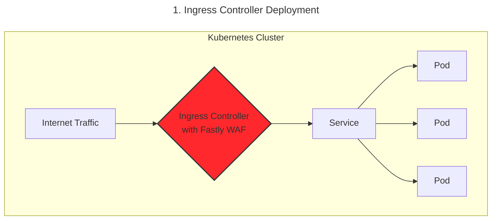
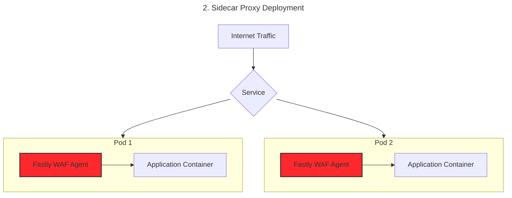
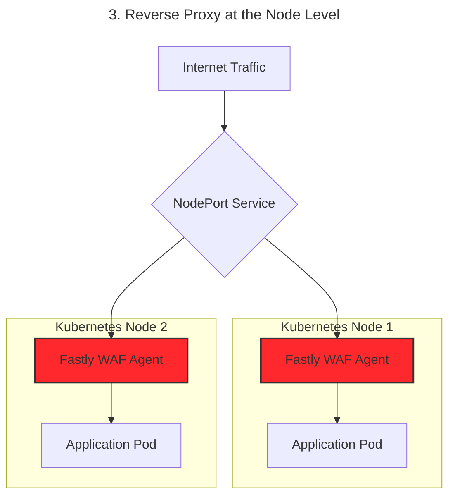
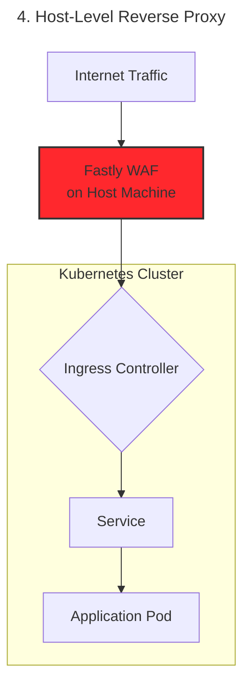
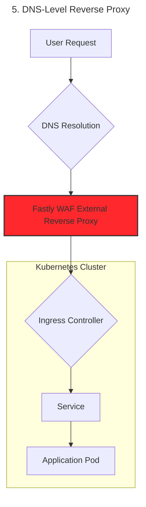
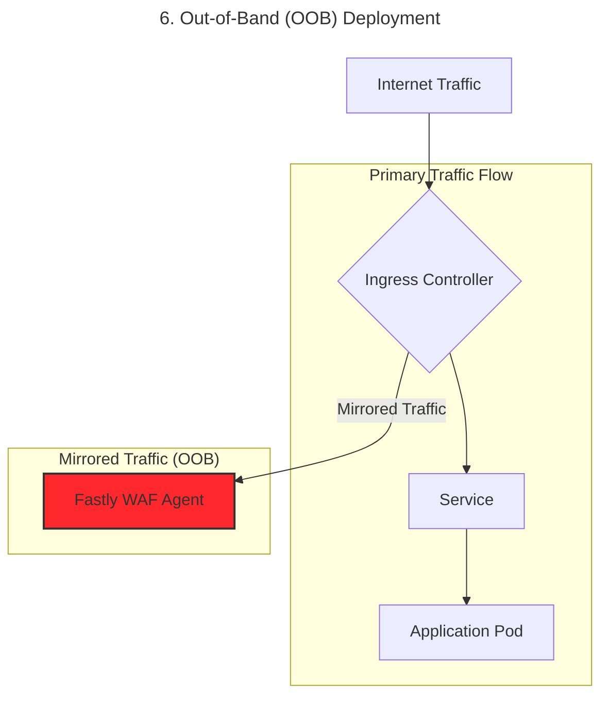
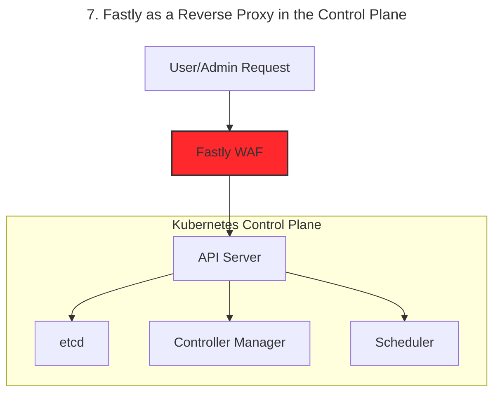

```mermaid
---
title: 1. Ingress Controller Deployment
---
flowchart TD
    subgraph Kubernetes Cluster
        direction LR
        A[Internet Traffic] --> B{Ingress Controller <br> with Fastly WAF};
        B --> C[Service];
        C --> D[Pod];
        C --> E[Pod];
        C --> F[Pod];
    end

    style B fill:#FF282D,stroke:#333,stroke-width:2px
```

```mermaid
---
title: 2. Sidecar Proxy Deployment
---
flowchart TD
    A[Internet Traffic] --> B{Service};
    
    subgraph pod1 ["Pod 1"]
        direction LR
        C[Fastly WAF Agent];
        D[Application Container];
        C --> D;
    end

    subgraph pod2 ["Pod 2"]
        direction LR
        E[Fastly WAF Agent];
        F[Application Container];
        E --> F;
    end
    
    B --> pod1;
    B --> pod2;

    style C fill:#FF282D,stroke:#333,stroke-width:2px
    style E fill:#FF282D,stroke:#333,stroke-width:2px

```

```mermaid
---
title: 3. Reverse Proxy at the Node Level
---
flowchart TD
    A[Internet Traffic] --> B{NodePort Service};

    subgraph "Kubernetes Node 1"
        C[Fastly WAF Agent] --> D[Application Pod];
    end

    subgraph "Kubernetes Node 2"
        E[Fastly WAF Agent] --> F[Application Pod];
    end

    B --> C;
    B --> E;

    style C fill:#FF282D,stroke:#333,stroke-width:2px
    style E fill:#FF282D,stroke:#333,stroke-width:2px
```

```mermaid
---
title: 4. Host-Level Reverse Proxy
---
flowchart TD
    A[Internet Traffic] --> B["Fastly WAF <br> on Host Machine"];
    
    subgraph cluster ["Kubernetes Cluster"]
        C{Ingress Controller};
        D[Service];
        E[Application Pod];
        C --> D --> E;
    end

    B --> C;
    style B fill:#FF282D,stroke:#333,stroke-width:2px
```

```mermaid
---
title: 5. DNS-Level Reverse Proxy
---
flowchart TD
    A[User Request] --> B{DNS Resolution};
    B --> C[Fastly WAF External Reverse Proxy];

    subgraph "Kubernetes Cluster"
        D{Ingress Controller};
        E[Service];
        F[Application Pod];
        D --> E --> F;
    end

    C --> D;
    style C fill:#FF282D,stroke:#333,stroke-width:2px
```

```mermaid
---
title: 6. Out-of-Band (OOB) Deployment
---
flowchart TD
    A[Internet Traffic] --> B{Ingress Controller};
    
    subgraph "Primary Traffic Flow"
        B --> C[Service];
        C --> D[Application Pod];
    end

    subgraph "Mirrored Traffic (OOB)"
        B -- Mirrored Traffic --> E[Fastly WAF Agent];
    end

    style E fill:#FF282D,stroke:#333,stroke-width:2px
```

```mermaid
---
title: 7. Fastly as a Reverse Proxy in the Control Plane
---
flowchart TD
    A[User/Admin Request] --> B[Fastly WAF];
    
    subgraph "Kubernetes Control Plane"
        C[API Server];
        D[etcd];
        E[Controller Manager];
        F[Scheduler];
        
        C --> D;
        C --> E;
        C --> F;
    end

    B --> C;
    style B fill:#FF282D,stroke:#333,stroke-width:2px
```
