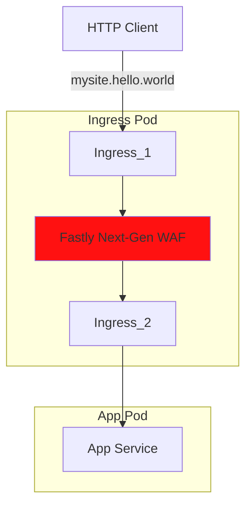

# Diagrams

```mermaid
flowchart TD
    Client[HTTP Client]
    Ingress_1[Ingress_1]
    NGWAF[Fastly Next-Gen WAF]
    App_service[App Service]
    
    Client --> |mysite.hello.world| Ingress_1
    subgraph Ingress_pod[Ingress Pod]
        Ingress_1 --> NGWAF
        NGWAF --> Ingress_2
    end

    subgraph App_pod[App Pod]
        Ingress_2 --> App_service
    end

    classDef fastlyClass fill:#F11
    class NGWAF fastlyClass;

%%Check out styling here, https://mermaid.js.org/syntax/flowchart.html
```