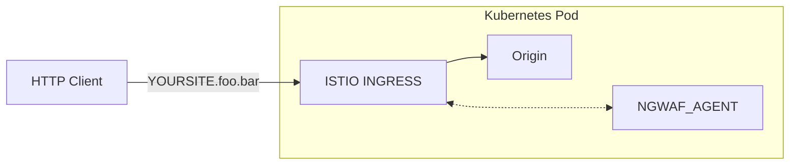

```mermaid

flowchart LR
    Client[HTTP Client]
    ISTIO_SERVICE[ISTIO INGRESS]
    %% NGWAF_CLOUD[Next-Gen WAF Cloud]
    ORIGIN[Origin]
    
    Client --> |YOURSITE.foo.bar| ISTIO_SERVICE
    subgraph k8s_pod[Kubernetes Pod]
        ISTIO_SERVICE <-..->  NGWAF_AGENT
        ISTIO_SERVICE --> ORIGIN
    end


    %% Out of band workflow
    %% NGWAF_CLOUD -->  NGWAF_COMPUTE

    %% classDef fastlyClass fill:#F00
    %% class NGWAF_COMPUTE fastlyClass;
    %% class NGWAF_CLOUD fastlyClass;

%%Check out styling here, https://mermaid.js.org/syntax/flowchart.html
```
