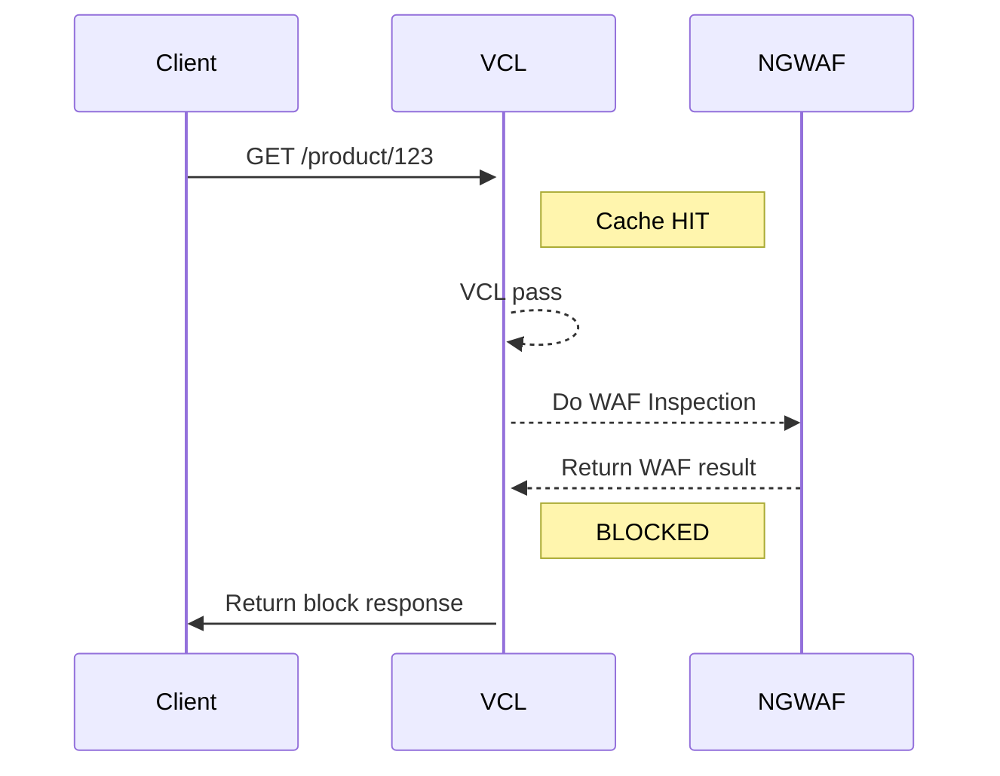
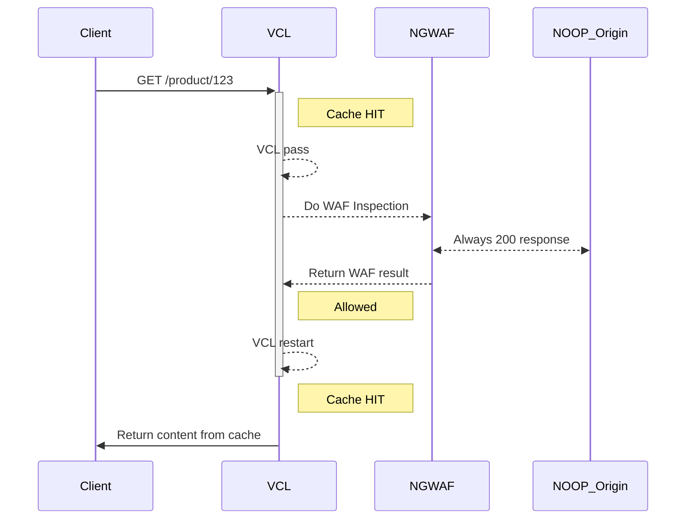

# Protecting Cached Content with the Fastly Next-Gen WAF

This implementation changes VCL in a way that allows the NGWAF to inspect content in cache. The NGWAF may be configured to block or challenge in cache content. If no action is taken by the NGWAF, then content may still then be returned from cache.

# Cache HIT
VCL receives request.
If the request is a cache HIT, then request is sent to vcl_pass.
From vcl_pass, the request is sent to the NGWAF.

## Note on shielding
It is expected that the request will be inspected by the WAF at the location where there is a cache HIT. This means that if shielding is used, then the edge PoP may be used for the NGWAF inspection if the cache HIT occurs at the Fastly edge PoP. If the request makes it to the shield where there is a cache HIT, then that is where the NGWAF will perform the inspection.

## Blocked or challenged
If the NGWAF returns a BLOCK or CHALLENGED signal, then the NGWAF response is returned to the client

## Not Blocked or challenged
If the NGWAF does not return a BLOCK or CHALLENGED signal, then a restart occurs.
The restart should then result in a cache HIT again. The content in cache is returned to the user. 

## Cache MISS
No change in the NGWAF or VCL behavior for a cache MISS.
