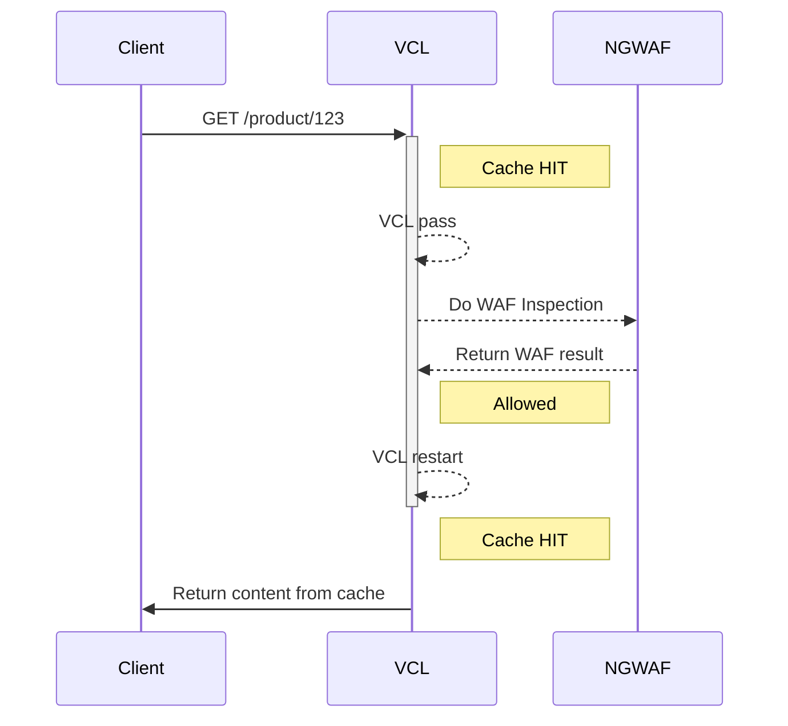

# Protecting Cached Content with the Fastly Next-Gen WAF

This implementation does the following

# Scenarios

There are numerous scenaros that may occur. Here are a few example workflows. 

## Cache HIT
VCL receives request.
If the request is a cache HIT, then request is sent to vcl_pass.
From vcl_pass, the request is sent to the NGWAF.

### Blocked or challenged
If the NGWAF returns a BLOCK or CHALLENGED signal, then the NGWAF response is returned to the client

### Not Blocked or challenged
If the NGWAF does not return a BLOCK or CHALLENGED signal, then a restart occurs.
The restart should then result in a cache HIT again. The content in cache is returned to the user. 

## Cache MISS
No change in the NGWAF or VCL behavior for a cache MISS.
